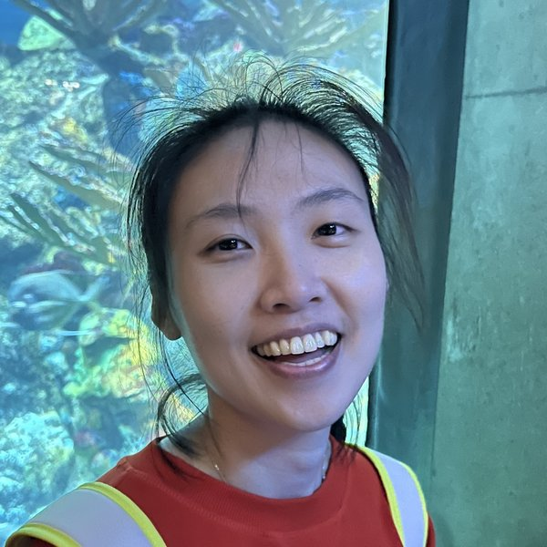

::: {.intro}
{.portrait fig-alt="Portrait of Christine Park"}

::: {.intro-copy}

Hello! I'm Christine Park and I’m a first year PhD student at [{.emblem aria-hidden="true"} Stanford University]{.school .stanford} studying computer science where I work on reliable and verifiable clinical AI. I'm very fortunate to be advised by Profs [Yejin Choi](https://yejinc.github.io/) and [Curtis Langlotz](https://profiles.stanford.edu/curtis-langlotz). 

My research asks: How can we train clinical AI systems to reason faithfully, revise their beliefs as evidence changes, and recognize when to defer to a human expert?

I’m especially interested in process-level and compositional rewards for clinical reasoning, temporal belief revision, and calibrated abstention and escalation. Across these projects, I aim to develop safer, more trustworthy clinical AI systems whose reasoning can be evaluated and improved.

Previously, I obtained my BA in chemistry at [{.emblem aria-hidden="true"} Dartmouth College]{.school .dartmouth}, advised by Prof [Glenn Micalizio](https://pharmsci.uci.edu/faculty/glenn-micalizio/). I received my MD and MEng in AI from [{.emblem aria-hidden="true"} Duke University]{.school .duke}. I trained in neurosurgery at the [{.emblem aria-hidden="true"} University of Washington]{.school .uw}. I worked as a visiting scholar at [{.emblem aria-hidden="true"} Carnegie Mellon University]{.school .cmu} advised by Prof [Tim Dettmers](https://csd.cmu.edu/people/faculty/tim-dettmers).

You can browse my [publications](publications.qmd) and [writing](blog.qmd)!

Feel free to reach out via [email](mailto:lechrisp@stanford.edu), [Twitter](https://x.com/sparkcpark/all) or [LinkedIn](https://www.linkedin.com/in/christine-park-642011230/)! 

:::
:::
